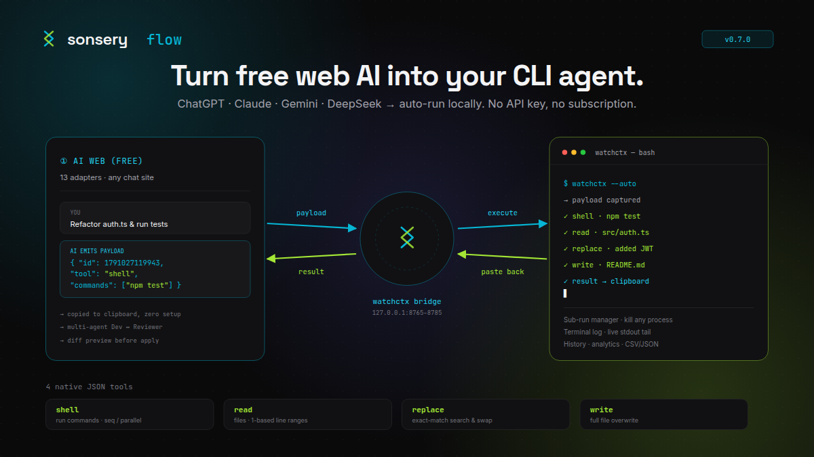

# Sonsery Flow Community - AI Workflow Automation

[](https://github.com/jsonnguyen19/sonsery-flow-community/actions/workflows/ci.yml)
[](./LICENSE)
[](https://www.python.org/downloads/)
[](https://developer.chrome.com/docs/extensions/develop/migrate/what-is-mv3)



> **Sonsery Flow** — use free web AI (ChatGPT, Claude, Gemini, DeepSeek, and more)
> as a coding agent, right inside your terminal. No API keys, no subscriptions,
> no token quotas. Copy a payload in the AI chat → the tool runs it on your
> machine → the result is pasted back. Automation loop, end to end.

A tool that automates the workflow between AI Chat (ChatGPT, Claude, Gemini, DeepSeek) and the terminal. Community edition — MIT, open source.

---

## How it works

1. Copy the payload from AI Chat to the clipboard
2. `watchctx` automatically detects it and executes the command
3. The result is copied back to the clipboard to paste into AI Chat

---

## Setup — step by step

Follow these steps **in order**. Each one ends with something you can verify
before moving on. Takes about 5 minutes.

### Step 1 — Clone the repo

```bash
git clone https://github.com/jsonnguyen19/sonsery-flow-community.git
cd sonsery-flow
```

### Step 2 — Run setup

```bash
pnpm setup
```

> No `pnpm`? Install it once: `npm install -g pnpm` (or see
> [pnpm.io](https://pnpm.io/installation)).
>
> Don't want pnpm? Run the script directly: `python3 scripts/setup.py`.

This creates the `venv/` folder, installs Python runtime deps, and writes the
wrapper scripts **`run`** and **`sync`** at the repo root.

### Step 3 — Test it runs

```bash
./run
```

You should see the clipboard watcher start and the HTTP bridge announce a port
in the `8765–8785` range. **Leave this terminal running.**

On Windows (cmd/PowerShell) use `run.bat` instead:

```powershell
.\run.bat
```

Open a **second terminal** for the next steps.

### Step 4 — Configure the alias (WSL first)

Setup does **NOT** write aliases for you — add them yourself so you can type
`watchctx` from any directory.

**WSL / Linux / macOS (bash / zsh)** — add to `~/.bashrc` or `~/.zshrc`,
replacing `/path/to/sonsery-flow` with your actual clone path:

```bash
alias watchctx='/path/to/sonsery-flow/run'
alias watchctx-sync='/path/to/sonsery-flow/sync'
```

<details>
<summary><b>Other shells (Windows PowerShell, cmd, Git Bash) — click to expand</b></summary>

**Windows PowerShell** — add to `$PROFILE`:

```powershell
function watchctx      { & "C:\path\to\sonsery-flow\run.bat" @args }
function watchctx-sync { & "C:\path\to\sonsery-flow\sync.bat" @args }
```

**Git Bash** — same as WSL, add to `~/.bashrc`:

```bash
alias watchctx='/c/path/to/sonsery-flow/run'
alias watchctx-sync='/c/path/to/sonsery-flow/sync'
```

**cmd.exe** — no native alias. Use `doskey` in a startup script, or just call
`C:\path\to\sonsery-flow\run.bat` directly.

</details>

### Step 5 — Reload your terminal

For the new aliases to take effect, either **open a new terminal** or source
the config file:

```bash
source ~/.zshrc      # zsh
. ~/.bashrc          # bash
```

### Step 6 — Verify the terminal

Still in the second terminal, run:

```bash
watchctx
```

You should see the same output as Step 3 (watcher + bridge). If it runs,
**your terminal setup is done** — Ctrl+C to stop, or leave it as your main
watcher terminal.

> If `watchctx: command not found`, the alias didn't load. Re-check Step 4
> path and re-run `source` from Step 5.

### Step 7 — Load the Chrome extension

The extension lives in `runctx-extension/`. To get its exact path (and the
Windows UNC form for WSL), run:

```bash
pnpm about
```

Copy the **Extension path** it prints. Then:

1. Open `chrome://extensions/` (or `edge://extensions/`).
2. Enable **Developer mode** (top-right toggle).
3. Click **Load unpacked** → paste the path
   (on WSL: paste the **Windows UNC path** — `\\wsl.localhost\<Distro>\home\...\runctx-extension` — into the Explorer address bar and press Enter first).
4. **Pin** the extension (puzzle-piece icon → pin).
5. **Reload** the extension once (the refresh icon on its card).

### Step 8 — Test with DeepSeek

1. Open `chat.deepseek.com`.
2. Click the pinned Sonsery Flow icon → the side panel opens.
3. Flip the **Automation** toggle **ON**.
4. **Copy this ready-made payload** and send it in the chat:

```json
{ "id": 1791016717000, "tool": "shell", "mode": "sequential", "commands": ["pwd"] }
```

> Bump the `id` to any newer millisecond timestamp (e.g. `Date.now()`) if the
> extension ever reports the payload as already processed.

5. Watch: the payload is copied → `watchctx` runs it → the result (your current
   working directory) is pasted back into the chat.

If you see the result come back, **setup is complete**. 🎉

---

## Bonus — a dedicated background Chrome for coding

**Recommended.** By default Chrome throttles timers, freezes tabs, and sleeps
background windows — this can pause the automation loop when the AI tab loses
focus. Launch Chrome with a **separate profile** and the flags below so the loop
keeps running even when you minimize or switch away.

| Flag | Purpose |
|---|---|
| `--user-data-dir="..."` | Separate profile, isolated from your daily Chrome |
| `--disable-background-timer-throttling` | Don't slow down timers in background tabs |
| `--disable-backgrounding-occluded-windows` | Don't deprioritize covered/occluded windows |
| `--disable-renderer-backgrounding` | Don't lower renderer priority in the background |
| `--intensive-wake-up-throttling-policy=disabled` | Disable aggressive wake-up throttling |

**Windows (PowerShell)** — creates a Desktop shortcut:

```powershell
$WshShell = New-Object -ComObject WScript.Shell
$ShortcutPath = "$([Environment]::GetFolderPath('Desktop'))\Chrome Agent.lnk"
$Shortcut = $WshShell.CreateShortcut($ShortcutPath)

$Shortcut.TargetPath = "C:\Program Files\Google\Chrome\Application\chrome.exe"
$Shortcut.Arguments = '--user-data-dir="%LOCALAPPDATA%\Google\Chrome\User Data Agent" --disable-background-timer-throttling --disable-backgrounding-occluded-windows --disable-renderer-backgrounding --intensive-wake-up-throttling-policy=disabled'

$Shortcut.Save()
```

**macOS** — launch from Terminal:

```bash
open -na "Google Chrome" --args \
  --user-data-dir="$HOME/Library/Application Support/Google/Chrome Agent" \
  --disable-background-timer-throttling \
  --disable-backgrounding-occluded-windows \
  --disable-renderer-backgrounding \
  --intensive-wake-up-throttling-policy=disabled
```

**Linux** — save as `~/.local/share/applications/chrome-agent.desktop`:

```ini
[Desktop Entry]
Name=Chrome Agent
Exec=/usr/bin/google-chrome --user-data-dir=%h/.config/google-chrome-agent --disable-background-timer-throttling --disable-backgrounding-occluded-windows --disable-renderer-backgrounding --intensive-wake-up-throttling-policy=disabled
Type=Application
Terminal=false
```

> **Note:** For Edge, replace the executable path (`chrome.exe` → `msedge.exe`,
> `Google Chrome` → `Microsoft Edge`) — flag names are identical.

> **Tip:** Install the extension into this dedicated profile once. Keep the
> window minimized in the background — the automation loop keeps running.

---

## Commands

| Command | What it does |
|---|---|
| `pnpm setup` | End-user setup: `venv/` + runtime deps + `run`/`sync` wrappers |
| `./run` | Start `watchctx` (clipboard watcher + HTTP bridge) |
| `./sync` | Sync prompts into the extension |
| `pnpm about` | Print extension path, bridge ports, available commands |
| `pnpm setup:dev` | Contributor setup (`.venv-test/` + dev deps) |

---

## Requirements

- Python 3.8+
- Chrome 100+ / Edge 100+ (Manifest V3)

No GPU, no Docker, no admin rights needed.

---

## Links

- **Website / Landing page** — <https://flow.sonsery.online/>
- **Community repo** — <https://github.com/jsonnguyen19/sonsery-flow-community>
- **Author portfolio** — <https://jasonnguyen.website/>
- **LinkedIn** — <https://www.linkedin.com/in/son-nguyen-650628344/>
- **Contact** — hongsonit10@gmail.com
- **Discord** — coming soon

---

## Contributing

Contributor / dev setup (dev venv, lint, format, typecheck, tests) lives in
[`docs/dev/setup.md`](docs/dev/setup.md). End-users never need it.

Repo layout:

- `watchctx.py` — entrypoint: clipboard watcher + HTTP bridge
- `runctx_core.py` — entrypoint: payload processing
- `runctx/` — main package
- `runctx-extension/` — Chrome/Edge extension
- `scripts/` — setup scripts (see [`scripts/README.md`](scripts/README.md))
- `scripts/split-community.sh` / `scripts/sync-community.sh` — Community repo
  build + sync (see [`docs/split/3-workflow.md`](docs/split/3-workflow.md))
- `prompts/` — prompt templates
- `tests/python/` — pytest test suite

See [`CONTRIBUTING.md`](CONTRIBUTING.md) for the full guide.
